## Hasta Kayit Kabul Projesi
* .NET Core ve SQL kullanarak bir Hasta Kayıt ve Kabul Sistemi geliştirdim. Bu projede,
hastaneye yeni bölümler eklenebilir ve bu bölümlere doktorlar atanabilir. Hastalar, TC
kimlik numarasını birincil anahtar olarak kullanarak sisteme kaydedilebilir. Bölüm ve
doktora göre tarihler seçilerek randevu alınabilir, ayrıca randevular günlük veya tüm
randevular şeklinde sorgulanabilir. Gerektiğinde randevuların iptal edilmesi de
mümkündür.

## Proje İçeriği
  * Bölüm Controller
    * Hastaneye bölüm ekleme  
  * Line 
    * When Shapes are placed in a line, the line is cleared
    

# Proje Görselleri
## Günlük Doktor Randevuları Listeleme
Günlük Doktor Randevuları Listeleme | Günlük Doktor Randevuları Listeleme |
------------ |------------ |
 |  |

## Bölüm Listeleme ve Ekleme
Bölüm Listeleme ve Ekleme | Bölüm Listeleme ve Ekleme | Bölüm Listeleme ve Ekleme | 
------------ |------------ | ------------ |
 |  |  |

## Doktor Listeleme ve Ekleme
Doktor Listeleme ve Ekleme | Doktor Listeleme ve Ekleme | Doktor Listeleme ve Ekleme | 
------------ |------------ | ------------ |
 | 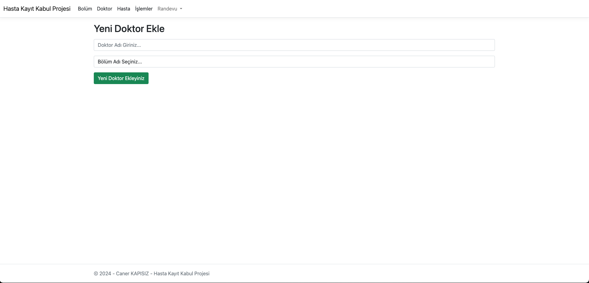 | 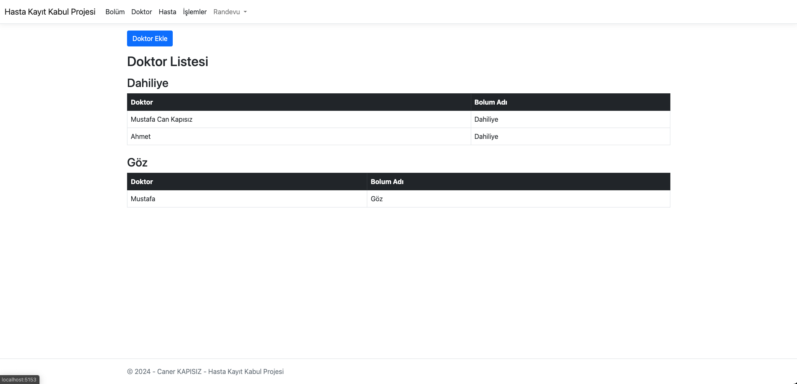 |

## Hasta Listeleme ve Ekleme
Hasta Listeleme ve Ekleme | Hasta Listeleme ve Ekleme | Hasta Listeleme ve Ekleme | 
------------ |------------ | ------------ |
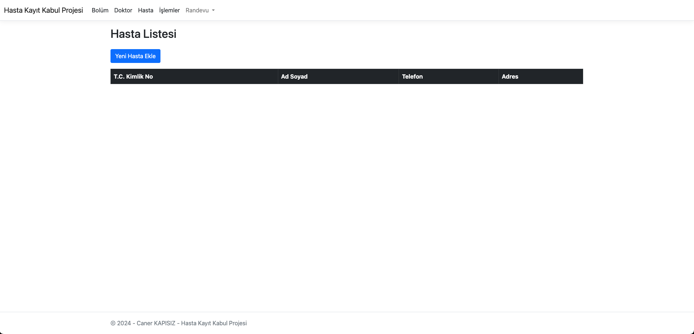 | 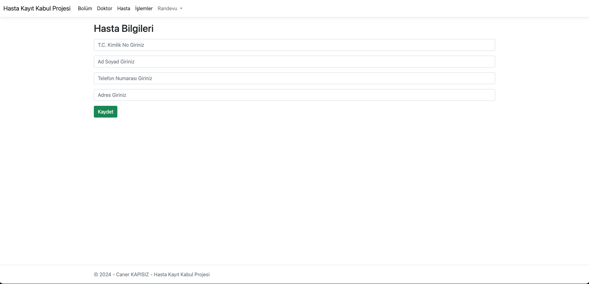 | 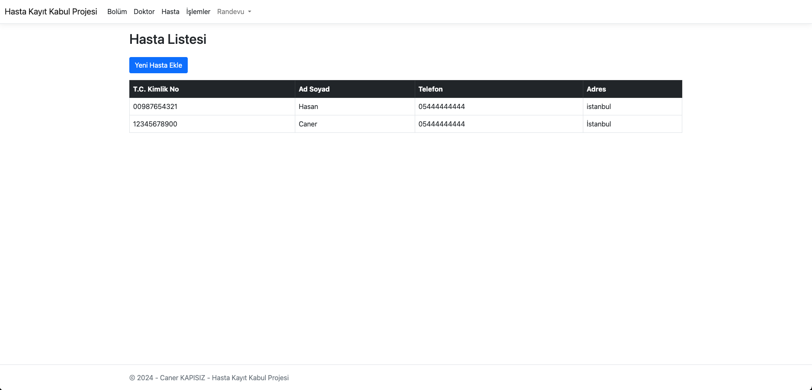 |

## Randevu İşlemleri 
Randevu Ekleme | Randevu Ekleme | Randevu Ekleme | 
------------ |------------ | ------------ |
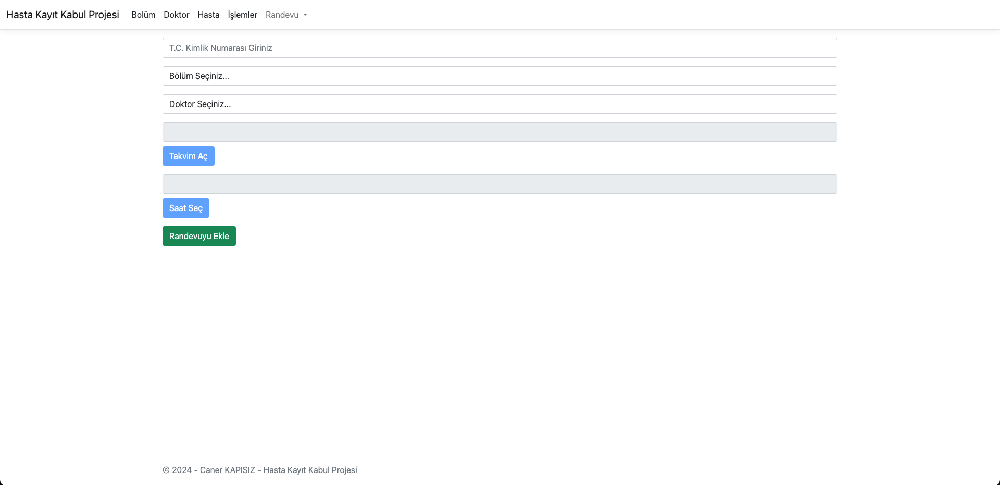 | 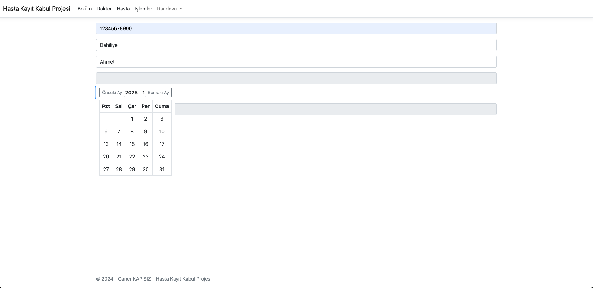 | 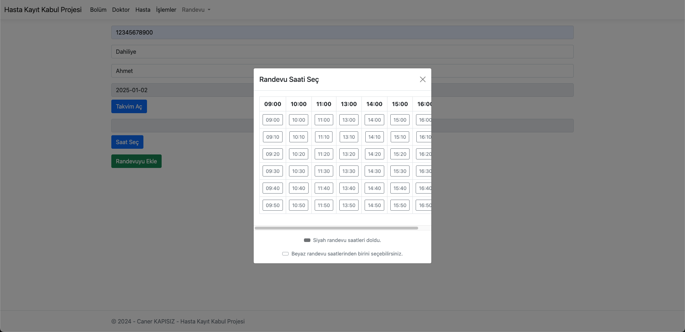 |
Randevu Silme | Randevu Sorgulama | 
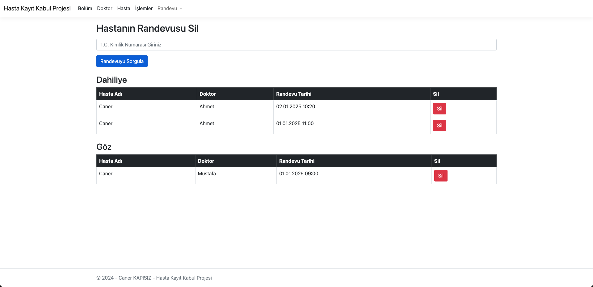 | 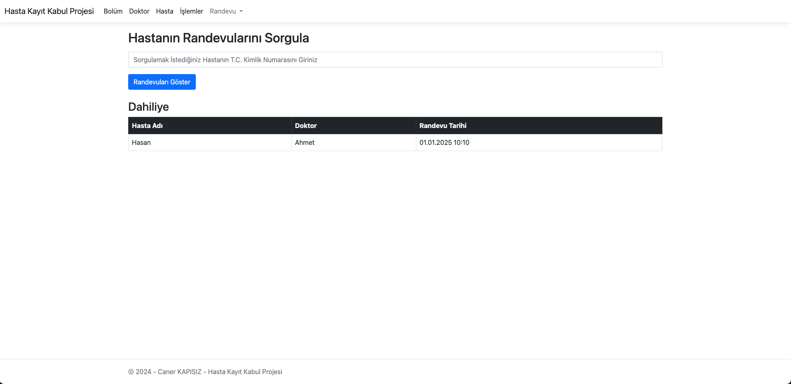 |

## Randevu İşlemleri 2
Doktor Günlük Randevu Listeleme | Doktor Günlük Randevu Listeleme | Doktora Hasta Kaydı Açma | Doktora Hasta Kaydı Açma | 
------------ |------------ | ------------ |------------ |
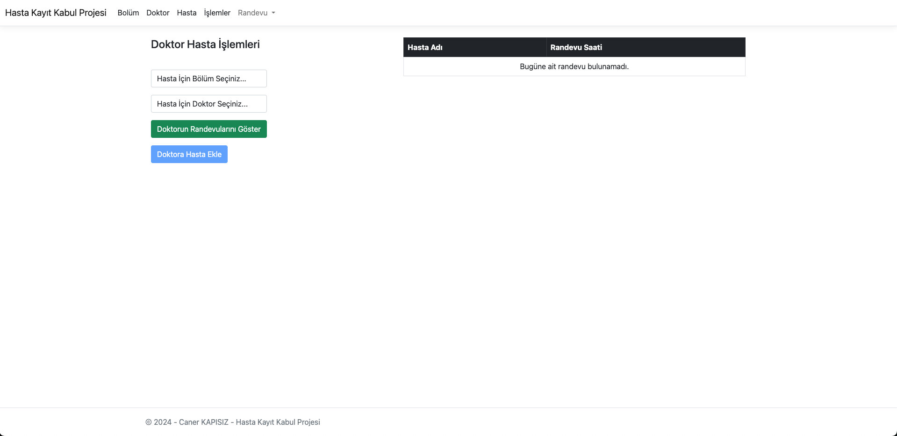 | 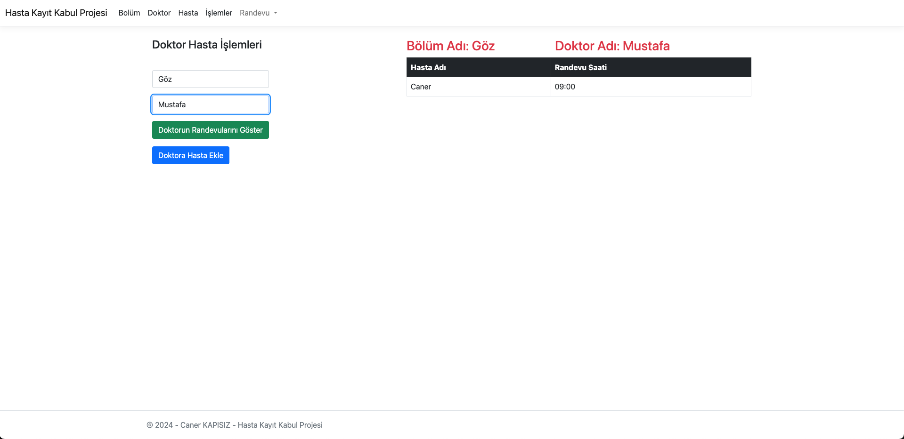 | 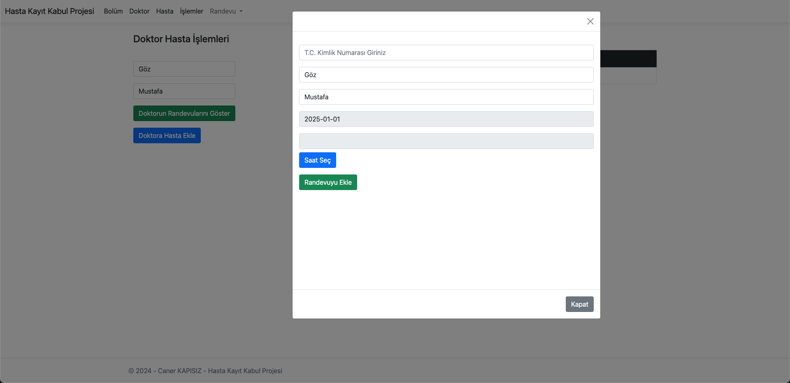 |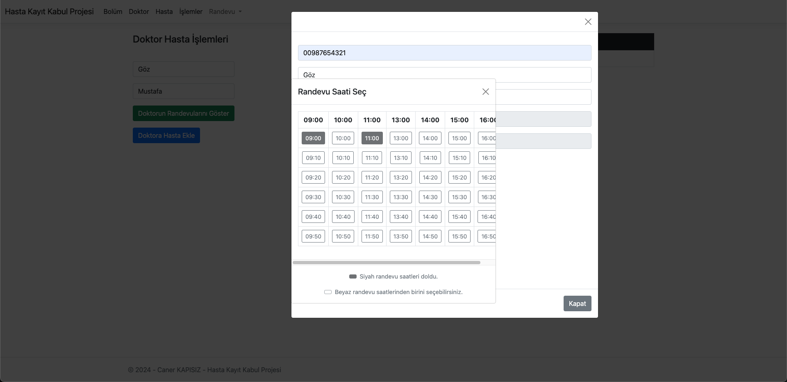 |

