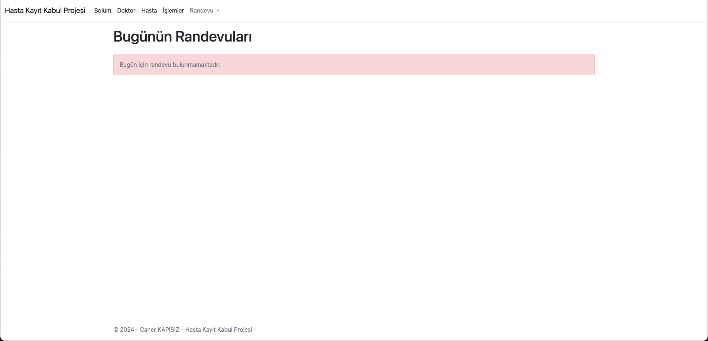
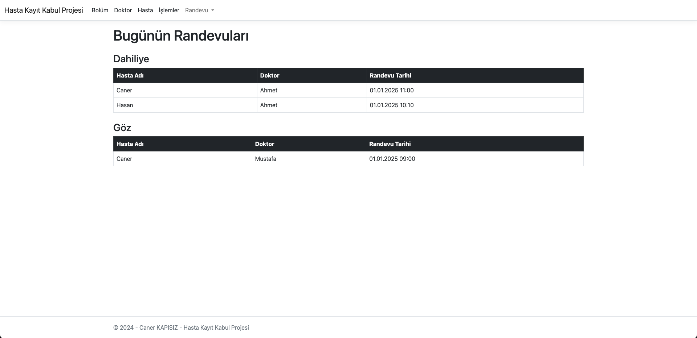
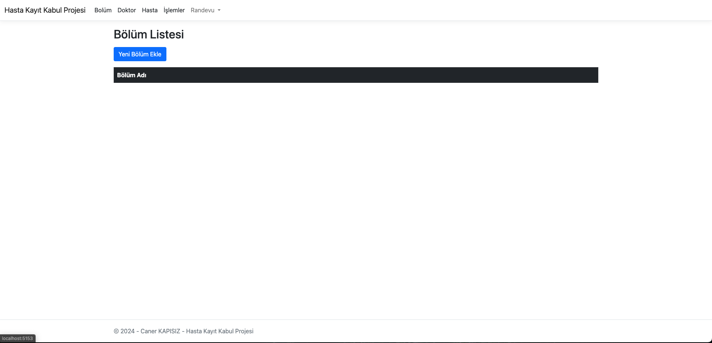
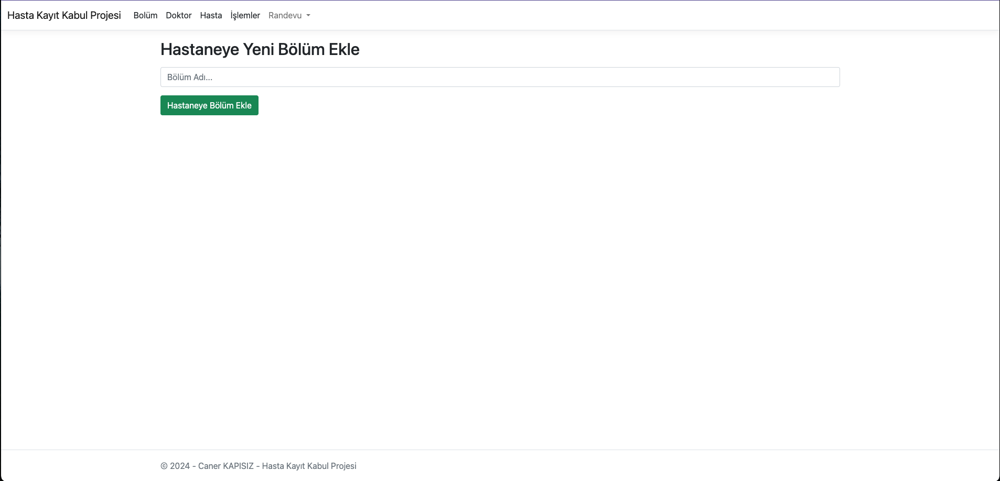

## Hasta Kayit Kabul Projesi
* .NET Core ve SQL kullanarak bir Hasta Kayıt ve Kabul Sistemi geliştirdim. Bu projede,
hastaneye yeni bölümler eklenebilir ve bu bölümlere doktorlar atanabilir. Hastalar, TC
kimlik numarasını birincil anahtar olarak kullanarak sisteme kaydedilebilir. Bölüm ve
doktora göre tarihler seçilerek randevu alınabilir, ayrıca randevular günlük veya tüm
randevular şeklinde sorgulanabilir. Gerektiğinde randevuların iptal edilmesi de
mümkündür.

## Proje İçeriği
  * Bölüm Controller
    * Hastaneye bölüm ekleme  
  * Line 
    * When Shapes are placed in a line, the line is cleared
    

# Proje Görselleri
## Günlük Doktor Randevuları Listeleme
Günlük Doktor Randevuları  |
  |

## Bölüm Listeleme ve Ekleme
------------ |------------ | ------------ |
 |  |  |

