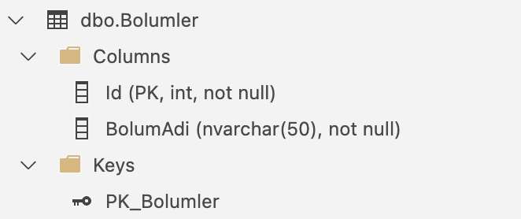
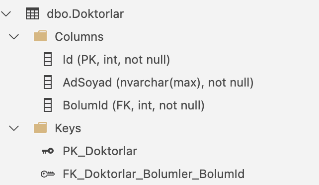

# Hasta Kayit Kabul Projesi
* .NET Core ve SQL ile geliştirdiğim Hasta Kayıt ve Kabul Sistemi, hastaneye yeni bölümler eklenmesine ve bu bölümlere doktor atanmasına olanak tanır. Hastalar, TC Kimlik Numarasını birincil anahtar olarak kullanarak sisteme kaydedilebilir. Bölüm ve doktor seçimiyle tarih belirlenerek randevu oluşturulabilir. Randevular günlük ya da tüm kayıtlar olarak sorgulanabilir ve gerektiğinde iptal edilebilir.

# Proje Görselleri ve Tanıtımı
## Günlük Doktor Randevuları Listeleme
* Her bölümün günlük randevuları bu ekrandan kolayca görüntülenebilir.
  
Günlük Doktor Randevuları Listeleme | Günlük Doktor Randevuları Listeleme |
------------ |------------ |
 |  |

## Bölüm Listeleme ve Ekleme
* Hastaneye yeni bölümler eklenebilir, ancak mevcut bölümler yeniden eklenemez.
* Hastanedeki mevcut bölümler listelenebilir.

Bölüm Listeleme ve Ekleme | Bölüm Listeleme ve Ekleme | Bölüm Listeleme ve Ekleme | 
------------ |------------ | ------------ |
 |  |  |

## Doktor Listeleme ve Ekleme
* Hasteneye bölüm seçilerek doktor eklenebilir.
* Her bölümün doktorları kendi aralarında gruplanarak listelenebilir.

Doktor Listeleme ve Ekleme | Doktor Listeleme ve Ekleme | Doktor Listeleme ve Ekleme | 
------------ |------------ | ------------ |
 |  |  |

## Hasta Listeleme ve Ekleme
* Hastalardan "TC Kimlik No, Ad Soyad, Telefon Numarası ve Adres" bilgileri alınır. Aynı TC Kimlik Numarasına sahip bir hasta yeniden kaydedilemez.
* Hastalar, bilgileriyle birlikte listelenebilir.
  
Hasta Listeleme ve Ekleme | Hasta Listeleme ve Ekleme | Hasta Listeleme ve Ekleme | 
------------ |------------ | ------------ |
 |  |  |

## Randevu İşlemleri 
* Hasta, TC Kimlik Numarasını girip bölüm ve doktor seçimi yaparak, tarih ve saat belirterek randevu oluşturabilir.
* Aynı hasta, aynı doktora aynı gün içinde randevu alamaz.
* Bir doktor için belirlenen tarih ve saatte, başka bir hasta randevu oluşturamaz.

Randevu Ekleme | Randevu Ekleme | Randevu Ekleme | 
------------ |------------ | ------------ |
 |  |  |
Randevu Silme | Randevu Sorgulama | 
 |  |

## Randevu İşlemleri 2
* Bölüm ve doktor bilgisine göre, doktorun o günkü hastaları listelenebilir.
* Bölüm ve doktor seçilerek, o gün için randevu oluşturulabilir.

Doktorun Günlük Randevu Listeleme | Doktorun Günlük Randevu Listeleme | Doktora Hasta Kaydı Açma | Doktora Hasta Kaydı Açma | 
------------ |------------ | ------------ |------------ |
 |  |  | |

# Database Görselleri
Bölüm Tablosu | Doktor Tablosu | Hasta Tablosu | Randevu Kayit Tablosu | 
------------ |------------ | ------------ |------------ |
 |  |  | |

